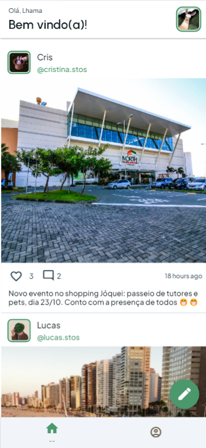

# Bairro.io

## 🚩 Apresentação
>O app é uma rede social onde uma comunidade pequena pode compartilhar eventos e notícias entre sí.
>Ele é o resultado de um levantamento de soluções para melhorar a comunicação na vizinhança através do desenvolvimento de software
>e foi desenvolvido para a conclusão de um projeto extensionista

## 🚀 Tecnologias empregadas
>- Desenvolvimento mobile fullstack em flutter
>- Firebase

## ☕ Usando o app

>- Cadastre-se no App
>- Personalize seu perfil com sua foto, seu nome e uma bio
>- Navegue pelo feed de publicações e veja o que os seus vizinhos publicaram
>- Compartilhe algum evento com o seu bairro
